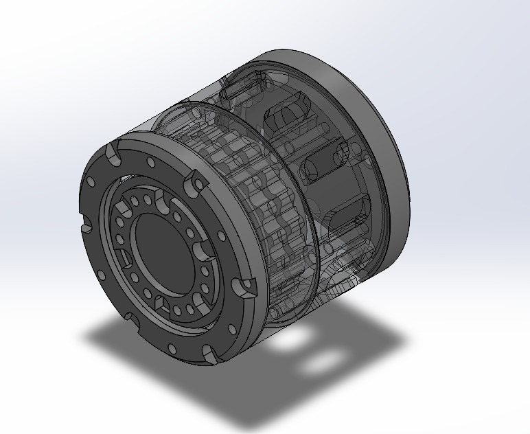
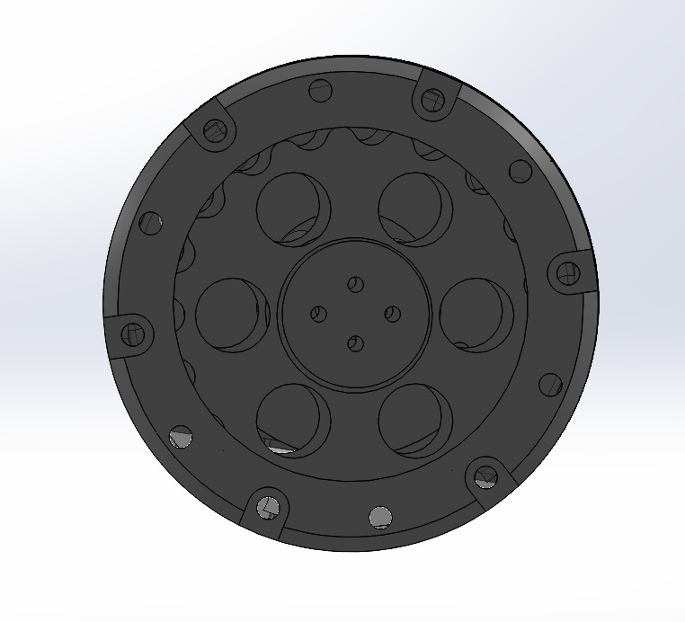
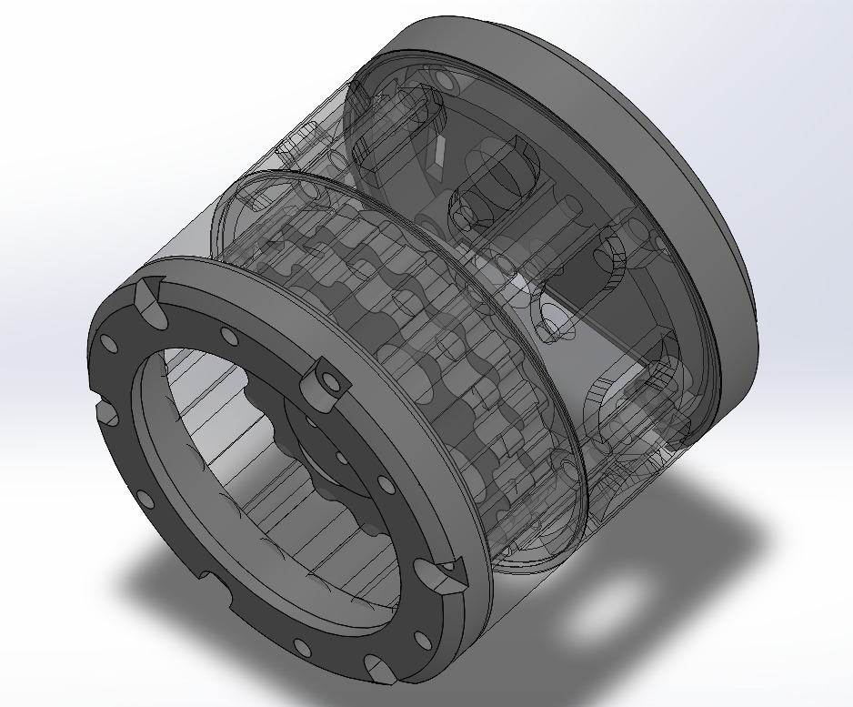
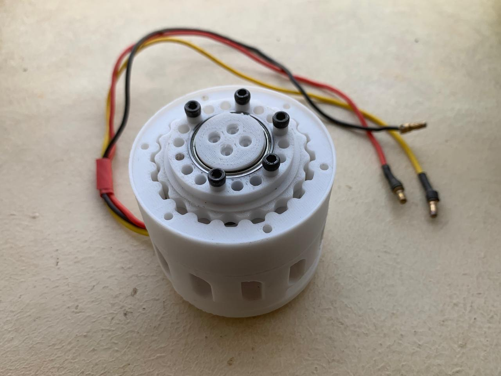
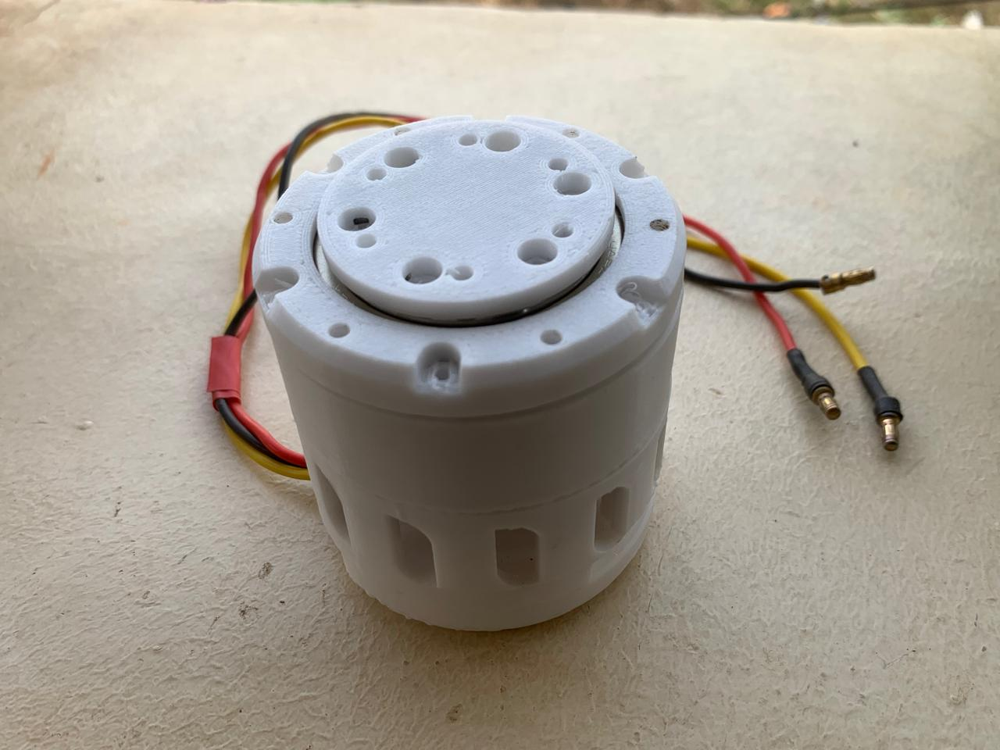

# 3D-Printed PETG Cycloidal Actuator (19:1)

## Project Overview
This project involves the design, prototyping, and performance analysis of a high-reduction cycloidal drive fabricated using PETG material via FDM 3D printing. Cycloidal drives offer significant advantages in robotics, such as high reduction ratios in a single stage and very low backlash. This research specifically investigates the feasibility of using PETG for functional mechanical actuators.
---

## Design Specifications
The actuator was modeled in SolidWorks with a profile generated via parametric equations.
* **Theoretical Reduction Ratio:** 19:1.
* **Eccentricity ($E$):** 2.0 mm.
* **Ring Pin Radius ($R$):** 40.0 mm.
* **Number of Ring Pins ($Z_r$):** 20.
* **Number of Cycloidal Lobes ($Z_d$):** 19.
* **Housing Dimensions:** 80 mm Diameter x 40 mm Height.

---

## CAD Assembly

  
   
  <em>Isometric View</em>

 

  
   
  <em>Front View</em>

 

  
   
  <em>Changed Transparency</em>

 

---

## Assembled Prototype

  
   
  <em>Assembly without Top Cover Plate</em>

 

  
   
  <em>Complete Assembly of Motor & Printed Parts</em>

 

---

## Fabrication & Materials
The components were fabricated using **PETG (Polyethylene Terephthalate Glycol)**, selected for its superior strength-to-flexibility ratio and low warping compared to PLA and ABS.

* **Infill Density:** 100%.
* **Infill Pattern:** Gyroid (for isotropic strength).
* **Layer Height:** 0.16 mm.
* **Wall Count:** 4.
* **Standard Parts:** Integrated 6202 deep groove ball bearings for the eccentric input shaft.

---

## Performance Analysis & Experimental Results
The actuator underwent systematic testing using a 5010 750kv BLDC motor and a custom test rig to verify its mechanical properties[cite: 370, 386].

| Metric | Measured Value | Ideal/Target |
| :--- | :--- | :--- |
| **Reduction Ratio** | 18.99:1  | 19:1 |
| **Peak Output Torque** | 5.28 Nm  | 11.0 Nm (Theoretical)  |
| **Max Efficiency** | 61.8% (at light load)  | 65% (Assumed) |
| **Backlash** | 0.24°  | < 0.5°  |

### Key Observations:
* **Precision:** The kinematic verification showed near-perfect agreement with the theoretical reduction ratio, confirming the accuracy of FDM-printed cycloidal geometry.
* **Backlash:** At 0.24°, the precision is comparable to industrial harmonic drives and vastly superior to standard spur gears.
* **Failure Mode:** Testing revealed that progressive plastic deformation of the cycloidal disc lobes is the dominant failure mode at input torques above 1.4 Nm.

---

## Repository Structure
* `/CAD`: .STEP files for assembly and .STL files for printing.
* `/Calculations`: MATLAB scripts for cycloidal profile generation.
* `/Docs`: Full Mini-Project report and technical presentation.
* `/Media`: Demo videos and high-res assembly photos.

---

## Future Scope
* Investigating **Carbon Fiber reinforced PETG** for higher stiffness and torque capacity.
* Integrating **metal sleeves/inserts** at high-stress contact points to mitigate lobe deformation.
* Implementation of **active cooling** schemes for high-load operations.

---

## Author

RAYHAAN T 
 
Final Year Mechanical Engineering Student | Robotics Enthusiast  
📍 Chennai, India  
🔗 linkedin.com/in/rayhaan-t-742709290/